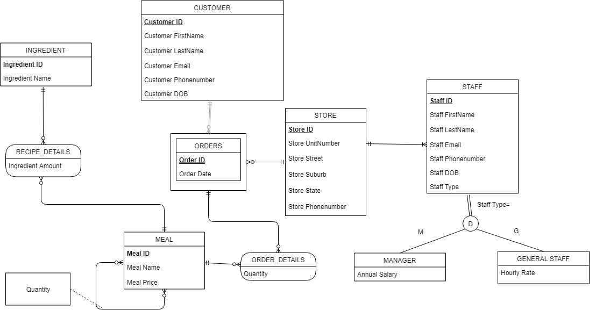
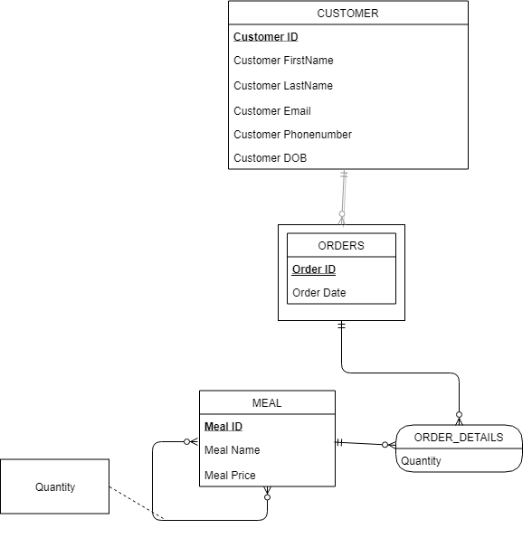

# restaurant-database
----
Hello there stranger! Welcome to Min's corner of the internet.
This is a restaurant database based on the online menu from MOS-Burgers.
The database was built from scratch with PosgresSQL.
The full ERD for this database is as followed.

However only a portion of the database was built and the ERD of that portion is as followed.

